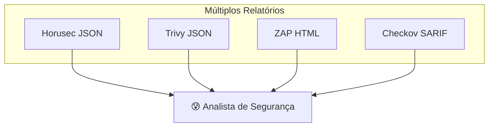
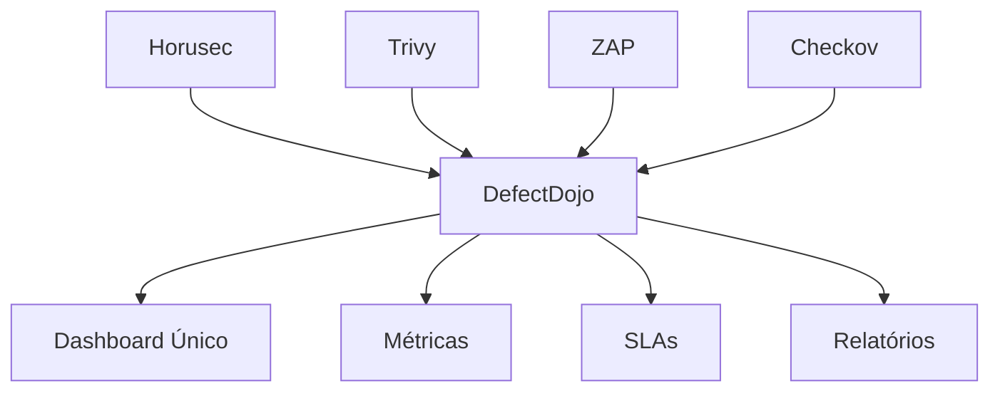
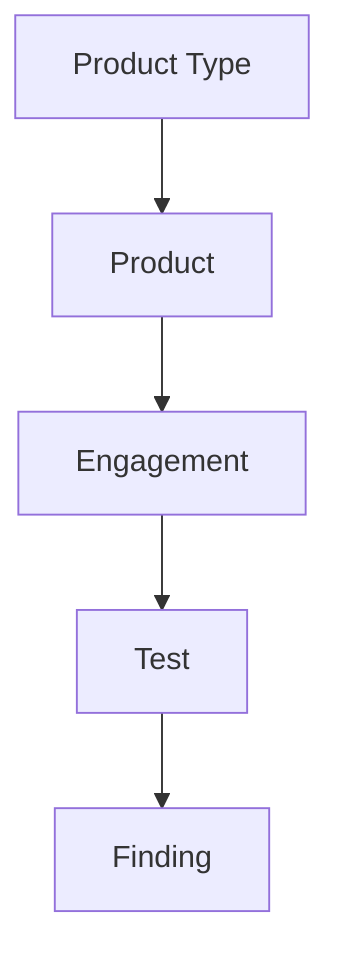

# 🎬 Vídeo 6.1 - Setup do DefectDojo

**Aula**: 6 - Centralização com DefectDojo  
**Vídeo**: 6.1  
**Temas**: Problema da fragmentação; DefectDojo; Docker Compose; Estrutura hierárquica

---

## 🚀 Antes de Começar

### Pré-requisitos

| Requisito | Como verificar |
|-----------|----------------|
| Docker instalado | `docker --version` |
| Docker Compose | `docker-compose --version` |
| 4GB+ RAM disponível | DefectDojo precisa de recursos |

### Opcional (para enriquecer)
- Reports de Horusec, Trivy ou ZAP (de outras aulas)

---

## 📚 Parte 1: O Problema da Fragmentação

### Passo 1: Situação Atual



**Perguntas difíceis de responder:**
- Quantas vulnerabilidades temos no total?
- Quais são críticas?
- Já corrigimos alguma?
- Estamos melhorando ou piorando?
- Quanto tempo levamos para corrigir?

---

### Passo 2: A Solução - Centralização



**Benefícios:**
- ✅ Visão unificada
- ✅ Deduplicação automática
- ✅ Tracking de correções
- ✅ Métricas e tendências
- ✅ Integração JIRA/Slack

---

### Passo 3: O que é DefectDojo?

**DefectDojo** = Plataforma de gestão de vulnerabilidades

**Características:**
- Open source (OWASP)
- 150+ formatos de import
- API REST completa
- Self-hosted ou SaaS

---

### Passo 4: Hierarquia do DefectDojo



| Nível | Exemplo | Descrição |
|-------|---------|-----------|
| **Product Type** | DevSecOps Course | Categoria de produtos |
| **Product** | App Vulnerável | Uma aplicação |
| **Engagement** | Sprint 2024-Q1 | Período de testes |
| **Test** | Trivy Scan | Uma execução de scan |
| **Finding** | CVE-2021-44228 | Uma vulnerabilidade |

---

## 🍴 Parte 2: Configurar Repositório

### Passo 5: Fork e Clone

1. Acesse: `https://github.com/josenetoo/fiap-dclt-devsecops-aula06`
2. Clique em **Fork** (ou clone diretamente)
3. Clone:

**Linux/Mac:**
```bash
cd ~/fiap-devsecops
git clone https://github.com/josenetoo/fiap-dclt-devsecops-aula06.git
cd fiap-dclt-devsecops-aula06
ls -la
```

**Estrutura esperada:**
```
fiap-dclt-devsecops-aula06/
├── defectdojo/
│   └── docker-compose.yml
├── sample-reports/
│   ├── horusec-results.json
│   ├── trivy-results.json
│   └── zap-results.json
└── docs/
```

---

## 🐳 Parte 3: Subir DefectDojo

### Passo 6: Verificar Docker Compose

**Linux/Mac:**
```bash
cat defectdojo/docker-compose.yml
```

**Componentes principais:**
- **nginx**: Reverse proxy
- **uwsgi**: Aplicação Django
- **celerybeat**: Agendamento
- **celeryworker**: Processamento assíncrono
- **postgres**: Banco de dados
- **redis**: Cache/filas

---

### Passo 7: Iniciar DefectDojo

**Linux/Mac:**
```bash
cd ~/fiap-devsecops/fiap-dclt-devsecops-aula06/defectdojo

# Subir todos os containers
docker-compose up -d

# Acompanhar logs do initializer
docker-compose logs -f initializer
```

**Windows (PowerShell):**
```powershell
cd ~\fiap-devsecops\fiap-dclt-devsecops-aula06\defectdojo

# Subir todos os containers
docker-compose up -d

# Acompanhar logs do initializer
docker-compose logs -f initializer
```

**Aguardar até ver:**
```
initializer_1  | Admin user created...
initializer_1  | DefectDojo initialization complete.
```

> ⏱️ Primeira inicialização leva 3-5 minutos

---

### Passo 8: Verificar Containers

**Linux/Mac:**
```bash
docker-compose ps
```

**Resultado esperado:**
```
NAME                    STATUS
defectdojo-nginx-1      Up
defectdojo-uwsgi-1      Up
defectdojo-postgres-1   Up
defectdojo-redis-1      Up
defectdojo-celerybeat-1 Up
defectdojo-celeryworker-1 Up
```

---

### Passo 9: Acessar Interface

1. Abra: http://localhost:8080
2. Login:
   - **Username**: `admin`
   - **Password**: `admin123`

**Resultado esperado:**
```
✅ Dashboard do DefectDojo carregado!
```

---

## 🏗️ Parte 4: Criar Estrutura

### Passo 10: Criar Product Type

1. Menu lateral > **Product Types**
2. Clique **+ Add Product Type**
3. Preencha:
   - Name: `DevSecOps Course`
   - Description: `Produtos do curso DevSecOps FIAP`
4. Clique **Submit**

---

### Passo 11: Criar Product

1. Menu lateral > **Products**
2. Clique **+ Add Product**
3. Preencha:
   - Name: `DevSecOps Lab App`
   - Product Type: `DevSecOps Course`
   - Description: `Aplicação vulnerável do laboratório`
4. Clique **Submit**

---

### Passo 12: Criar Engagement

1. Dentro do Product, clique **+ Add Engagement**
2. Preencha:
   - Name: `Pipeline CI/CD`
   - Target Start: Hoje
   - Target End: +30 dias
   - Status: `In Progress`
3. Clique **Submit**

---

### Passo 13: Gerar API Key

1. Clique no usuário (canto superior direito)
2. **API v2 Key**
3. Copie a API Key

> 📝 Guarde essa key! Você vai usar para upload automático.

---

## 🔧 Troubleshooting

| Erro | Causa | Solução |
|------|-------|---------|
| Porta 8080 ocupada | Outro serviço | Mudar porta no docker-compose |
| Out of memory | Pouco RAM | Mínimo 4GB RAM |
| Login falha | Senha errada | Verificar logs do initializer |

---

**FIM DO VÍDEO 6.1** ✅
