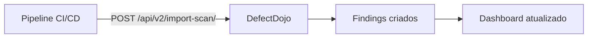

# 🎬 Vídeo 6.2 - Ingestão de Reports

**Aula**: 6 - Centralização com DefectDojo  
**Vídeo**: 6.2  
**Temas**: Upload via interface; API do DefectDojo; Relatórios de exemplo

---

> ℹ️ **Nota**: Este hands-on usa o DefectDojo **Open Source (Free)**. A interface pode ser diferente da versão Pro.

---

## 📁 Parte 1: Relatórios de Exemplo

### Passo 1: Conhecer os Relatórios Disponíveis

Este repositório inclui relatórios prontos para demonstração na pasta `sample-reports/`:

| Arquivo | Scanner | Tipo | Vulnerabilidades |
|---------|---------|------|------------------|
| `horusec-results.json` | Horusec | SAST | 5 findings (secrets, SQL injection) |
| `trivy-results.json` | Trivy | SCA/Container | 8 CVEs (incluindo Log4Shell) |
| `zap-results.json` | OWASP ZAP | DAST | 6 findings (XSS, headers) |

> 💡 Estes arquivos simulam relatórios reais para praticar sem executar scans.

---

## 📤 Parte 2: Upload via Interface Web

### Passo 2: Acessar o Engagement

Na versão **Open Source**, o Import Scan é feito a partir de um **Engagement**:

1. Acesse DefectDojo: http://localhost:8080
2. Login: `admin` / `admin123`
3. Menu lateral > **Engagements** > **All Engagements**
4. Clique no engagement `Pipeline CI/CD` (criado na aula 6.1)

---

### Passo 3: Acessar Import Scan

Dentro do Engagement, você tem duas opções:

**Opção A - Via Tests:**
1. Na página do Engagement, clique na aba **Tests**
2. Clique no botão **Import Scan Results**

**Opção B - Via Findings:**
1. Na página do Engagement, clique em **Findings**
2. Clique no botão **Import Scan Results**

---

### Passo 4: Upload do Relatório SAST (Horusec)

1. Na tela **Import Scan**, preencha:

| Campo | Valor | Descrição |
|-------|-------|-----------|
| **Scan Type** | `Generic Findings Import` | ⚠️ Use este tipo para todos os relatórios |
| **Scan File** | `horusec-results.json` | Clique em Choose e selecione da pasta `sample-reports/` |
| **Active** | ✅ Marcado | Findings serão marcados como ativos |
| **Verified** | ✅ Marcado | Findings serão marcados como verificados |

> 💡 O **Engagement** já está pré-selecionado pois você acessou via engagement.

2. Clique **Import**

**Resultado esperado:**
```
✅ 5 findings importados
   - 2 Critical (API Key, SQL Injection)
   - 2 High (senha hardcoded, eval)
   - 1 Medium (logging sensível)
```

---

### Passo 5: Upload do Relatório SCA (Trivy)

1. Volte ao Engagement: **Engagements** > **Pipeline CI/CD**
2. Clique em **Import Scan Results** novamente
3. Preencha:

| Campo | Valor |
|-------|-------|
| **Scan Type** | `Generic Findings Import` |
| **Scan File** | `trivy-results.json` |
| **Active** | ✅ Marcado |
| **Verified** | ✅ Marcado |

4. Clique **Import**

**Resultado esperado:**
```
✅ 8 CVEs importados
   - 1 Critical (CVE-2021-44228 - Log4Shell)
   - 3 High (HTTP/2, glibc, ncurses)
   - 2 Medium (expat, semver)
   - 2 Low (libgcrypt, braces)
```

---

### Passo 6: Upload do Relatório DAST (ZAP)

1. Volte ao Engagement: **Engagements** > **Pipeline CI/CD**
2. Clique em **Import Scan Results**
3. Preencha:

| Campo | Valor |
|-------|-------|
| **Scan Type** | `Generic Findings Import` |
| **Scan File** | `zap-results.json` |
| **Active** | ✅ Marcado |
| **Verified** | ✅ Marcado |

4. Clique **Import**

**Resultado esperado:**
```
✅ 6 findings importados
   - 2 High (XSS Reflected, SQL Injection)
   - 1 Medium (Clickjacking)
   - 3 Low (headers de segurança)
```

---

### Passo 7: Verificar Findings Importados

1. Menu lateral > **Findings** > **All Findings**
2. Ou: **Products** > `DevSecOps Lab App` > **Findings**

**Você deve ver:**
- Total: ~19 findings
- Distribuição por severidade no gráfico
- Lista detalhada com cada vulnerabilidade

---

## 📊 Parte 3: Explorando os Findings

### Passo 8: Visualizar Detalhes de um Finding

1. Clique em qualquer finding (ex: `CVE-2021-44228 - Apache Log4j2...`)
2. Observe os campos:
   - **Title**: Nome da vulnerabilidade
   - **Severity**: Critical, High, Medium, Low
   - **Description**: Descrição detalhada
   - **Mitigation**: Como corrigir
   - **References**: Links para mais informações
   - **Component**: Componente afetado (quando disponível)

---

### Passo 9: Filtrar Findings

Use os filtros disponíveis:

| Filtro | Exemplo |
|--------|---------|
| **Severity** | Critical, High |
| **Status** | Active, Verified |
| **Test Type** | Horusec, Trivy, ZAP |
| **Date** | Últimos 7 dias |

---

## 🔌 Parte 4: API do DefectDojo (Opcional)

### Passo 10: Visão Geral da API

O DefectDojo também oferece API REST para automação:



**Endpoints principais:**

| Endpoint | Método | Descrição |
|----------|--------|-----------|
| `/api/v2/import-scan/` | POST | Importar report |
| `/api/v2/findings/` | GET | Listar findings |
| `/api/v2/products/` | GET | Listar produtos |

---

### Passo 11: Obter API Key

1. Clique no usuário (canto superior direito)
2. **API v2 Key**
3. Copie o token

---

### Passo 12: Upload via cURL (Exemplo)

```bash
# Variáveis
DEFECTDOJO_URL="http://localhost:8080"
API_KEY="seu_token_aqui"
ENGAGEMENT_ID="1"

# Upload report Horusec
curl -X POST "${DEFECTDOJO_URL}/api/v2/import-scan/" \
  -H "Authorization: Token ${API_KEY}" \
  -F "scan_type=Horusec Scan" \
  -F "file=@sample-reports/horusec-results.json" \
  -F "engagement=${ENGAGEMENT_ID}" \
  -F "verified=true" \
  -F "active=true"
```

> 📝 A automação via API é útil para integrar com pipelines CI/CD.

---

## 🤖 Parte 5: Automação no Pipeline (Opcional)

> ⚠️ **Esta seção é opcional** - Para quem deseja automatizar o envio de reports durante o build no CI/CD.

### Passo 13: Criar Script de Upload

Crie o arquivo `scripts/upload-report.sh`:

```bash
#!/bin/bash
# Upload scan results to DefectDojo
# Usage: ./upload-report.sh <SCAN_TYPE> <FILE_PATH>

DEFECTDOJO_URL="${DEFECTDOJO_URL:-http://localhost:8080}"
API_KEY="${DEFECTDOJO_API_KEY}"
ENGAGEMENT_ID="${DEFECTDOJO_ENGAGEMENT_ID}"
SCAN_TYPE="$1"
FILE_PATH="$2"

if [ -z "$API_KEY" ] || [ -z "$ENGAGEMENT_ID" ] || [ -z "$SCAN_TYPE" ] || [ -z "$FILE_PATH" ]; then
    echo "Usage: DEFECTDOJO_API_KEY=xxx DEFECTDOJO_ENGAGEMENT_ID=1 ./upload-report.sh <SCAN_TYPE> <FILE_PATH>"
    echo ""
    echo "Scan types: 'Trivy Scan', 'Horusec Scan', 'ZAP Scan'"
    exit 1
fi

echo "Uploading $FILE_PATH to DefectDojo..."

curl -X POST "${DEFECTDOJO_URL}/api/v2/import-scan/" \
    -H "Authorization: Token ${API_KEY}" \
    -F "scan_type=${SCAN_TYPE}" \
    -F "file=@${FILE_PATH}" \
    -F "engagement=${ENGAGEMENT_ID}" \
    -F "verified=true" \
    -F "active=true" \
    -F "scan_date=$(date +%Y-%m-%d)"

echo ""
echo "Done!"
```

```bash
# Tornar executável
chmod +x scripts/upload-report.sh
```

---

### Passo 14: Usar o Script

```bash
# Definir variáveis de ambiente
export DEFECTDOJO_API_KEY="seu_token_aqui"
export DEFECTDOJO_ENGAGEMENT_ID="1"

# Upload dos relatórios
./scripts/upload-report.sh "Horusec Scan" sample-reports/horusec-results.json
./scripts/upload-report.sh "Trivy Scan" sample-reports/trivy-results.json
./scripts/upload-report.sh "ZAP Scan" sample-reports/zap-results.json
```

---

### Passo 15: Configurar Secrets no GitHub

Para automatizar no pipeline CI/CD:

1. GitHub > Settings > Secrets > Actions
2. Adicione:

| Secret | Valor |
|--------|-------|
| `DEFECTDOJO_URL` | `http://<IP>:8080` |
| `DEFECTDOJO_API_KEY` | Token da API |
| `DEFECTDOJO_ENGAGEMENT_ID` | ID do engagement |

---

### Passo 16: Job de Upload no GitHub Actions

Adicione ao seu workflow `.github/workflows/security.yml`:

```yaml
  # ============================================
  # JOB: Upload para DefectDojo
  # ============================================
  upload-defectdojo:
    name: 📤 Upload to DefectDojo
    runs-on: ubuntu-latest
    needs: [horusec, trivy-sca]
    if: always()
    
    steps:
      - name: 📥 Download Horusec Report
        uses: actions/download-artifact@v4
        with:
          name: horusec-report
          path: reports/

      - name: 📥 Download Trivy Report
        uses: actions/download-artifact@v4
        with:
          name: trivy-sca-report
          path: reports/

      - name: 📤 Upload Horusec to DefectDojo
        run: |
          curl -X POST "${{ secrets.DEFECTDOJO_URL }}/api/v2/import-scan/" \
            -H "Authorization: Token ${{ secrets.DEFECTDOJO_API_KEY }}" \
            -F "scan_type=Horusec Scan" \
            -F "file=@reports/horusec-results.json" \
            -F "engagement=${{ secrets.DEFECTDOJO_ENGAGEMENT_ID }}" \
            -F "verified=true" \
            -F "active=true"

      - name: 📤 Upload Trivy to DefectDojo
        run: |
          curl -X POST "${{ secrets.DEFECTDOJO_URL }}/api/v2/import-scan/" \
            -H "Authorization: Token ${{ secrets.DEFECTDOJO_API_KEY }}" \
            -F "scan_type=Trivy Scan" \
            -F "file=@reports/trivy-sca-results.json" \
            -F "engagement=${{ secrets.DEFECTDOJO_ENGAGEMENT_ID }}" \
            -F "verified=true" \
            -F "active=true"
```

---

## 🔧 Troubleshooting

| Problema | Causa | Solução |
|----------|-------|---------|
| Scan type não encontrado | Nome incorreto | Verificar dropdown exato |
| 0 findings importados | Formato incompatível | Verificar se JSON está correto |
| Engagement não aparece | Não foi criado | Voltar para aula 6.1 |
| 401 Unauthorized (API) | Token inválido | Verificar API Key |
| Connection refused (API) | DefectDojo down | Verificar containers |

---

**FIM DO VÍDEO 6.2** ✅
