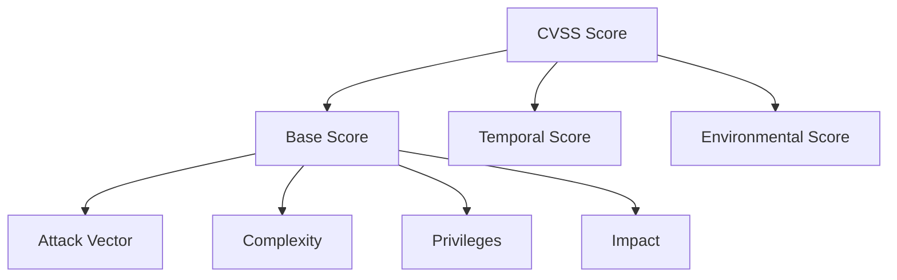
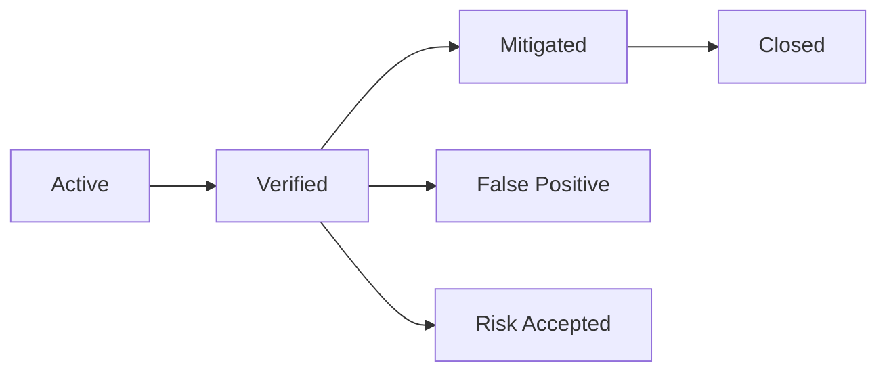

# 🎬 Vídeo 6.3 - Métricas e SLAs

**Aula**: 6 - Centralização com DefectDojo  
**Vídeo**: 6.3  
**Temas**: CVSS; SLAs; Dashboard; KPIs de segurança

---

## 🚀 Pré-requisito

> ⚠️ **Importante**: Você precisa ter completado a **Aula 6.2** com os 3 relatórios importados (Horusec, Trivy, ZAP) para visualizar métricas no dashboard.

**Verificar:**
1. Acesse http://localhost:8080
2. Menu > **Findings**
3. Deve ter ~19 findings importados

Se não tiver, volte para a aula 6.2 e faça o upload dos relatórios.

---

## 📚 Parte 1: Entendendo CVSS (Teoria)

> ℹ️ **Nota**: O CVSS é um conceito fundamental em segurança. Embora nossos relatórios de exemplo não incluam o score numérico, o DefectDojo usa CVSS para determinar a **severidade** dos findings.

### Passo 1: O que é CVSS?

**CVSS** = Common Vulnerability Scoring System

É o padrão da indústria para classificar a gravidade de vulnerabilidades. Todo CVE publicado no NVD (National Vulnerability Database) possui um score CVSS.

**Escala de 0.0 a 10.0:**

| Score | Severidade | Cor | Exemplo dos nossos relatórios |
|-------|------------|-----|-------------------------------|
| 9.0 - 10.0 | **Critical** | 🔴 | CVE-2021-44228 (Log4Shell) = **10.0** |
| 7.0 - 8.9 | **High** | 🟠 | CVE-2023-4911 (glibc) = **7.8** |
| 4.0 - 6.9 | **Medium** | 🟡 | CVE-2022-40674 (expat) = **5.5** |
| 0.1 - 3.9 | **Low** | 🟢 | CVE-2021-33560 (libgcrypt) = **3.7** |
| 0.0 | **Info** | ⚪ | Informativo apenas |

---

### Passo 2: Exemplos Práticos de CVSS

**CVE-2021-44228 (Log4Shell) - Score 10.0 (Critical)**
```
Attack Vector:    Network (pode ser explorado remotamente)
Attack Complexity: Low (fácil de explorar)
Privileges:       None (não precisa de credenciais)
User Interaction: None (não precisa de interação)
Impact:           High (execução de código remoto)
```
> 🔴 Score máximo porque é fácil de explorar remotamente e dá controle total.

**CVE-2023-4911 (glibc - Looney Tunables) - Score 7.8 (High)**
```
Attack Vector:    Local (precisa de acesso local)
Attack Complexity: Low (fácil de explorar)
Privileges:       Low (precisa de usuário básico)
Impact:           High (escalação de privilégios)
```
> 🟠 Score alto, mas requer acesso local.

---

### Passo 3: Componentes do CVSS



**Fatores que aumentam o score:**
- ✅ Atacável pela **rede** (vs local)
- ✅ **Baixa** complexidade de ataque
- ✅ **Sem** necessidade de privilégios
- ✅ **Alto** impacto (confidencialidade, integridade, disponibilidade)

**Consultar CVSS de uma CVE:**
- Acesse: https://nvd.nist.gov/vuln/detail/CVE-2021-44228
- Veja o score e o vetor CVSS detalhado

---

## ⏱️ Parte 2: Definindo SLAs

### Passo 4: O que são SLAs de Segurança?

**SLA** = Service Level Agreement

**Para vulnerabilidades**: Tempo máximo para correção

| Severidade | SLA Sugerido | Justificativa |
|------------|--------------|---------------|
| **Critical** | 24 horas | Risco imediato |
| **High** | 7 dias | Risco alto |
| **Medium** | 30 dias | Risco moderado |
| **Low** | 90 dias | Risco baixo |

---

### Passo 5: Configurar SLAs no DefectDojo

1. Clique no **ícone de engrenagem** ⚙️ (canto superior direito)
2. Selecione **System Settings**
3. Role até a seção **SLA Configuration**
4. Preencha os valores (em dias):

| Campo | Valor | Significado |
|-------|-------|-------------|
| **SLA Critical** | `1` | 1 dia para corrigir críticos |
| **SLA High** | `7` | 7 dias para corrigir altos |
| **SLA Medium** | `30` | 30 dias para corrigir médios |
| **SLA Low** | `90` | 90 dias para corrigir baixos |

5. Role até o final e clique **Submit**

**Resultado esperado:**
```
✅ System settings updated successfully
```

> 💡 Os SLAs agora serão calculados automaticamente para todos os findings!

---

## 📊 Parte 3: Dashboard e Métricas

### Passo 6: Navegar no Dashboard

1. Menu lateral > **Dashboard** (ou clique no logo DefectDojo)

**O que você verá:**

| Seção | O que mostra |
|-------|--------------|
| **Severity Counts** | Gráfico de pizza com Critical/High/Medium/Low |
| **Top 10 Products** | Produtos com mais vulnerabilidades |
| **Unassigned Findings** | Findings sem responsável |
| **Reported Findings** | Findings reportados recentemente |

> ℹ️ **Nota**: O widget de SLA Compliance pode não estar disponível na versão Open Source. Os SLAs são calculados internamente, mas a visualização depende da versão.

---

### Passo 7: Métricas por Produto

1. Products > DevSecOps Lab App
2. Tab **Metrics**

**Métricas disponíveis:**
- Findings por severidade
- Findings por status
- Tempo médio para correção (MTTR)
- Tendência de abertura vs fechamento

---

### Passo 8: KPIs Importantes

| KPI | O que mede | Meta |
|-----|------------|------|
| **MTTD** | Mean Time to Detect | < 1 dia |
| **MTTR** | Mean Time to Remediate | Depende severidade |
| **SLA Compliance** | % corrigido no prazo | > 95% |
| **Critical Backlog** | Críticos abertos | = 0 |
| **Open Vulns** | Total aberto | Tendência ↓ |

---

## 🔄 Parte 4: Workflow de Findings

### Passo 9: Status de um Finding



| Status | Significado |
|--------|-------------|
| **Active** | Recém importado |
| **Verified** | Confirmado como real |
| **Mitigated** | Correção aplicada |
| **Closed** | Verificado e fechado |
| **False Positive** | Não é vulnerabilidade real |
| **Risk Accepted** | Aceito o risco |

---

### Passo 10: Atualizar Status de Finding

1. Menu lateral > **Findings**
2. Clique em um finding (ex: `Hard-coded API Key`)
3. Clique no botão **Edit** (ou ícone de lápis)
4. Altere os campos:

| Campo | Valor |
|-------|-------|
| **Active** | ✅ Marcado |
| **Verified** | ✅ Marcado |
| **Mitigated** | ❌ Desmarcado (ainda não corrigido) |

5. Adicione um **comentário**: `Verificado - aguardando correção do time de dev`
6. Clique **Submit**

---

### Passo 11: Exercício Prático - Triagem de Vulnerabilidades

Vamos simular uma triagem real. Faça as seguintes ações:

**1. Marcar um False Positive:**
- Vá em Findings
- Encontre: `Web Browser XSS Protection Not Enabled`
- Edit > Marque **False Positive** ✅
- Comentário: `Aplicação é API REST, não serve HTML`
- Submit

**2. Aceitar um Risco:**
- Encontre: `Strict-Transport-Security Header Not Set`
- Edit > Marque **Risk Accepted** ✅
- Comentário: `Ambiente de desenvolvimento apenas`
- Submit

**3. Marcar como Mitigado:**
- Encontre: `Hard-coded password detected`
- Edit > Marque **Mitigated** ✅
- Comentário: `Migrado para variável de ambiente`
- Submit

**Resultado:** O dashboard agora mostrará:
- Findings reduzidos de ~19 para ~16 ativos
- Métricas de False Positive e Risk Accepted

---

## 📈 Parte 5: Relatórios

### Passo 12: Gerar Relatório Executivo

1. Menu lateral > **Products**
2. Clique em `DevSecOps Lab App`
3. Clique no botão **Generate Report**
4. Selecione tipo:
   - **Executive Summary** - Resumo para gestão
   - **Technical Report** - Detalhes técnicos
   - **Finding Details** - Lista completa

5. Formato: **HTML** (mais fácil para visualizar)
6. Clique **Generate**

**Resultado esperado:**
```
✅ Relatório HTML gerado com:
   - Resumo executivo
   - Distribuição por severidade
   - Lista de findings
   - Métricas do produto
```

---

### Passo 13: Verificar Métricas Após Triagem

1. Volte ao **Dashboard**
2. Observe as mudanças:

| Métrica | Antes | Depois |
|---------|-------|--------|
| **Active Findings** | ~19 | ~16 |
| **False Positives** | 0 | 1 |
| **Risk Accepted** | 0 | 1 |
| **Mitigated** | 0 | 1 |

> 💡 As métricas são atualizadas em tempo real conforme você faz triagem!

---

## 📊 Parte 6: Visualizar Tendências

### Passo 14: Gráfico de Tendência

1. Dashboard > **Metrics**
2. Selecione período (30, 60, 90 dias)
3. Analise:

```
Findings Over Time
      ▲
   40 │    ╭──╮
   30 │   ╱    ╲
   20 │  ╱      ╲────
   10 │ ╱            ╲
    0 │╱               ────
      └─────────────────────▶
        Jan  Fev  Mar  Abr
        
        ── Abertos   ── Fechados
```

**Bom sinal**: Fechados > Abertos

---

## 🔧 Troubleshooting

| Problema | Causa | Solução |
|----------|-------|---------|
| SLA não aparece | Não configurado | ⚙️ > System Settings > SLA Configuration |
| Métricas vazias | Sem findings | Completar aula 6.2 primeiro |
| Dashboard vazio | Produto sem dados | Verificar se engagement tem scans |
| Relatório falha | Sem findings no produto | Importar pelo menos 1 scan |

---

**FIM DO VÍDEO 6.3** ✅
